<h2>TensorFlow-FlexUNet-Image-Segmentation-Brain-Tumor-MRI (2026/01/30)</h2>
Sarah T.  Arai 
Software Laboratory antillia.com  
This is the first experiment of Image Segmentation for <b>Brain-Tumor-MRI</b> based on our <a href="./src/TensorFlowFlexUNet.py">TensorFlowFlexUNet</a> 
(TensorFlow Flexible UNet Image Segmentation Model for Multiclass) , 
and 
<a href="https://drive.google.com/file/d/1jruP9FlZBHEfvtaAITYCQo1e0s1qmtkf/view?usp=sharing">
<b>Augmented-Brain-Tumor-MRI-ImageMask-Dataset.zip</b></a> with colorized masks, which was derived by us from   
<a href="https://www.kaggle.com/datasets/indk214/brain-tumor-dataset-segmentation-and-classification/data">
<b>Brain Tumor Dataset: Segmentation & Classification</b> </a> on the kaggle.com.
  

<b>Actual Image Segmentation for Brain-Tumor-MRI Images of 512x512 pixels </b> 
As shown below, the inferred masks predicted by our segmentation model trained by the dataset appear similar to the ground truth masks.
 
<b>rgb_map = {Glioma:yellow,  Meningioma:green, Pituitary tumor: mazenda}
</b>
  
<table>
<tr>
<th>Input: image</th>
<th>Mask (ground_truth)</th>
<th>Prediction: inferred_mask</th>
</tr>
<tr>
<td>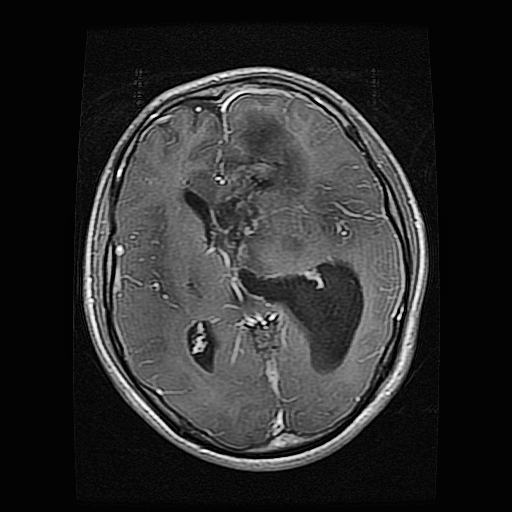</td>
<td></td>
<td></td>
</tr>

<tr>
<td>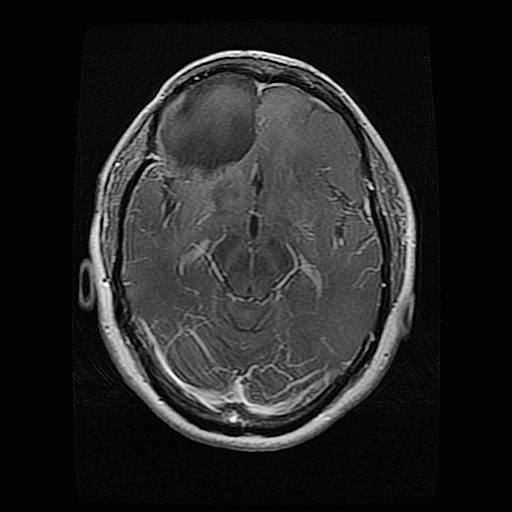</td>
<td>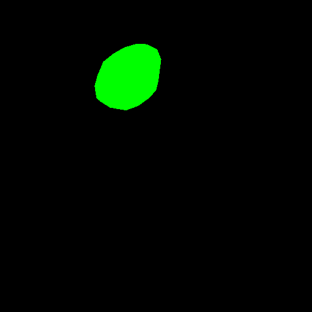</td>
<td>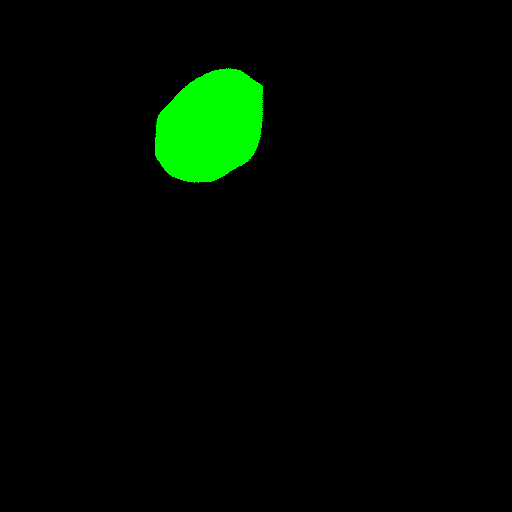</td>
</tr>

<tr>
<td>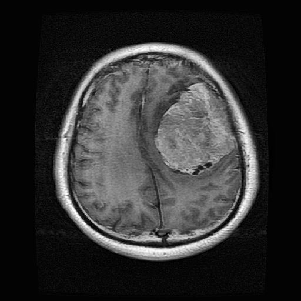</td>
<td></td>
<td>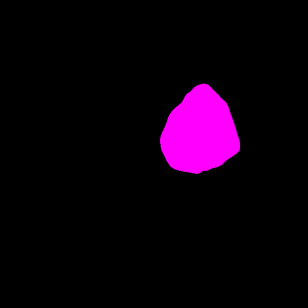</td>
</tr>
</table>

 
<h3>1  Dataset Citation</h3>
The dataset used here was derived from   
<a href="https://www.kaggle.com/datasets/gaoweihao/amd-sd/data">
<a href="https://www.kaggle.com/datasets/indk214/brain-tumor-dataset-segmentation-and-classification/data">
<b>Brain Tumor Dataset: Segmentation & Classification</b> </a> on the kaggle.com. 
<b>License:</b>
<a href="https://www.apache.org/licenses/LICENSE-2.0">Apache 2.0</a>
  
The following explanation was taken from <a href="https://www.kaggle.com/datasets/indk214/brain-tumor-dataset-segmentation-and-classification/data">
<b>Brain Tumor Dataset: Segmentation & Classification</b> </a>
  
<b>About Dataset</b> 
This repository contains a curated and enhanced version of brain tumor MRI images derived from two publicly available datasets.  
The dataset is suitable for both brain tumor segmentation and classification tasks, including tumor type detection (e.g., glioma, meningioma, pituitary tumors).
  
<b>Original Datasets Used</b> 
The data in this repository has been collected, preprocessed, and enhanced from the following two sources:  
<b>1. Kaggle Brain Tumor MRI Dataset</b> 
o Link: <a href="https://www.kaggle.com/datasets/masoudnickparvar/brain-tumor-mri-dataset">
https://www.kaggle.com/datasets/masoudnickparvar/brain-tumor-mri-dataset</a> 
o Contains 3D MRI scans categorized into four classes:
<ul>
<li>No tumor</li>
<li>Glioma tumor</li>
<li>Meningioma tumor</li>
<li>Pituitary tumor</li>
</ul>
<b>2. SciDB Brain Tumor Dataset</b> 
<b>License:<a href="https://creativecommons.org/licenses/by/4.0/">CC BY 4.0</a></b> 
<ul>
<li> Link: <a href="https://www.scidb.cn/en/detail?dataSetId=faa44e0a12da4c11aeee91cc3c8ac11e">
https://www.scidb.cn/en/detail?dataSetId=faa44e0a12da4c11aeee91cc3c8ac11e</a></li>
<li> Includes annotated MRI slices with tumor segmentation masks.</li>
<li> Contains various types of brain tumors with pixel-level annotations.</li>
</ul>
 
<b>Dataset Enhancements</b> 
To improve usability, consistency, and performance for deep learning models, we have applied several enhancements: 
Image Preprocessing 
<ul>
<li>Normalization: Intensity normalization to range [0, 1]</li>
<li> Noise Reduction: Gaussian filtering and contrast enhancement applied</li>
</ul>
 
<b>Citation</b> 
<ul>
<li> Masoud Nickparvar, Kaggle Brain Tumor Dataset, 2020.</li>
<li>SciDB Brain Tumor Dataset, SciDB, 2021.</li>
</ul>
 
<b>License</b> 
Original datasets are used under their respective licenses.  
Please check each source for specific usage rights. 

Enhancements and reorganization in this repository are released under the MIT License. 
 

<h3>
2 Brain-Tumor-MRI ImageMask Dataset
</h3>
 If you would like to train this Brain-Tumor-MRI Segmentation model by yourself,
please down load our dataset <a href="https://drive.google.com/file/d/1jruP9FlZBHEfvtaAITYCQo1e0s1qmtkf/view?usp=sharing">
<b>Augmented-Brain-Tumor-MRI-ImageMask-Dataset.zip</b>
</a> on the google drive,
expand the downloaded, and put it under <b>./dataset/</b> to be.
<pre>
./dataset
└─Brain-Tumor-MRI
    ├─test
    │   ├─images
    │   └─masks
    ├─train
    │   ├─images
    │   └─masks
    └─valid
        ├─images
        └─masks
</pre>
 
<b>Brain-Tumor-MRI Statistics</b> 
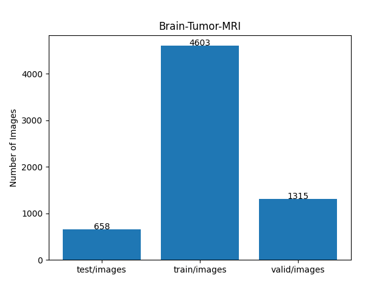 
 
As shown above, the number of images of train and valid datasets is large enough to use for a training set of our segmentation model.
  

<b>Train_images_sample</b> 
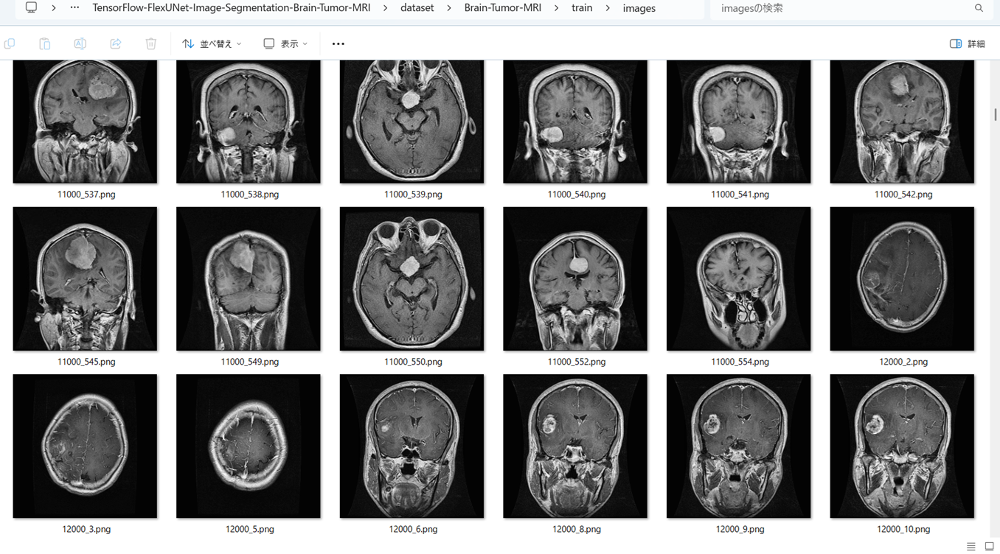
 
<b>Train_masks_sample</b> 
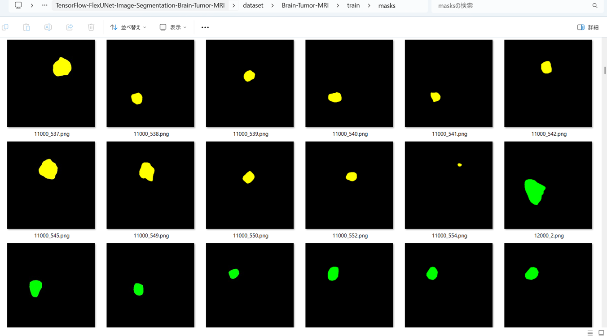
 
<h3>
3 Train TensorflowFlexUNet Model
</h3>
 We trained Brain-Tumor-MRI TensorflowFlexUNet Model by using the following
<a href="./projects/TensorFlowFlexUNet/Brain-Tumor-MRI/train_eval_infer.config"> <b>train_eval_infer.config</b></a> file.  
Please move to ./projects/TensorFlowFlexUNet/Brain-Tumor-MRI and run the following bat file. 
<pre>
>1.train.bat
</pre>
, which simply runs the following command. 
<pre>
>python ../../../src/TensorFlowFlexUNetTrainer.py ./train_eval_infer.config
</pre>

<b>Model parameters</b> 
Defined a small <b>base_filters=16</b> and a large <b>base_kernels=(11,11)</b> for the first Conv Layer of Encoder Block of 
<a href="./src/TensorFlowFlexUNet.py">TensorFlowFlexUNet.py</a> 
and a large num_layers (including a bridge between Encoder and Decoder Blocks).
<pre>
[model]
image_width    = 512
image_height   = 512
image_channels = 3
input_normalize = True
normalization  = False
num_classes    = 6
base_filters   = 16
base_kernels  = (11,11)
num_layers    = 8
dropout_rate   = 0.05
dilation       = (1,1)
</pre>

<b>Learning rate</b> 
Defined a small learning rate.  
<pre>
[model]
learning_rate  = 0.00007
</pre>

<b>Loss and metrics functions</b> 
Specified "categorical_crossentropy" and "dice_coef_multiclass". 
<pre>
[model]
loss           = "categorical_crossentropy"
metrics        = ["dice_coef_multiclass"]
</pre>
<b >Learning rate reducer callback</b> 
Enabled learing_rate_reducer callback, and a small reducer_patience.
<pre> 
[train]
learning_rate_reducer = True
reducer_factor     = 0.5
reducer_patience   = 4
</pre>
<b>Early stopping callback</b> 
Enabled early stopping callback with patience parameter.
<pre>
[train]
patience      = 10
</pre>
<b></b> 
<b>RGB color map</b> 
rgb color map dict for Brain-Tumor-MRI 1+5 classes. 
<pre>
[mask]
mask_file_format = ".png"
;Brain-Tumor-MRI 1+5
;         Background,    SRF:blue,    PED:red,      IRF:green,    SHRM:yellow,     IS/OS:cyan     
rgb_map = {(0,0,0):0,  (0,0,255):1, (255,0,0):2, (0,255,0):3, (255,255,0):4, (0,255,255):5,} 
</pre>
<b>Epoch change inference callbacks</b> 
Enabled epoch_change_infer callback. 
<pre>
[train]
epoch_change_infer       = True
epoch_change_infer_dir   =  "./epoch_change_infer"
epoch_changeinfer        = False
epoch_changeinfer_dir    = "./epoch_changeinfer"
num_infer_images         = 6
</pre>
By using this epoch_change_infer callback, on every epoch_change, the inference procedure can be called
 for 6 images in <b>mini_test</b> folder. This will help you confirm how the predicted mask changes 
 at each epoch during your training process.    
<b>Epoch_change_inference output at starting (1,2,3)</b> 
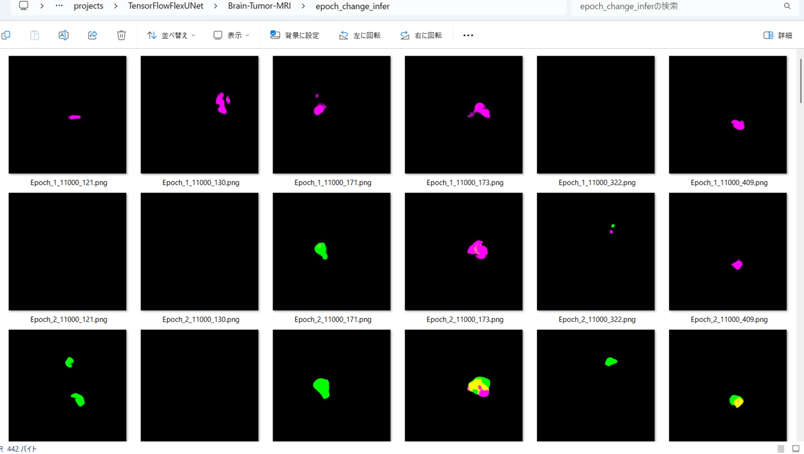 
 
<b>Epoch_change_inference output at middle-point (23,24,25)</b> 
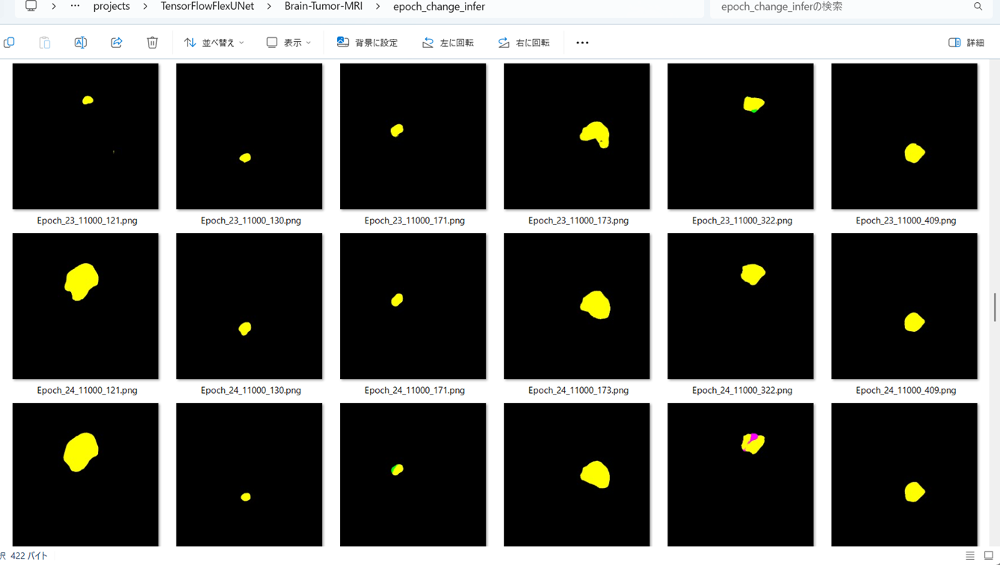 
 
<b>Epoch_change_inference output at ending (48,49,50)</b> 
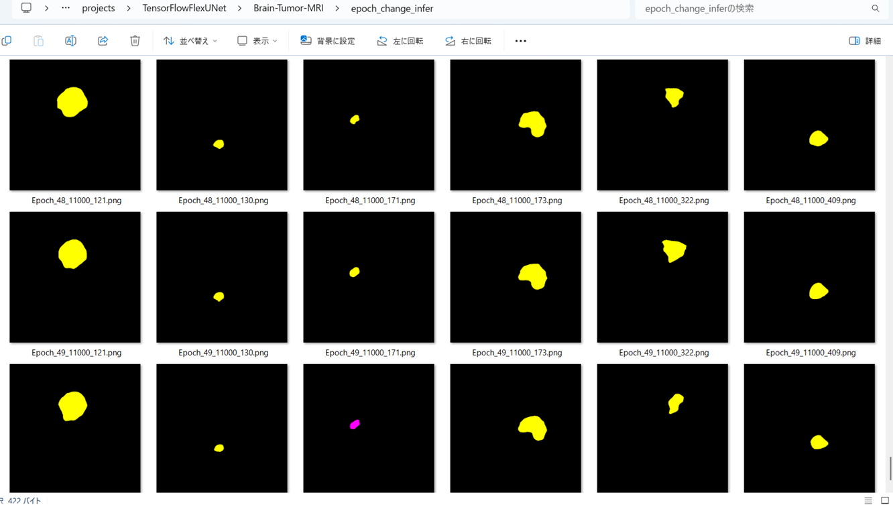 

 
In this experiment, the training process was stopped at epoch 50 by EarlyStoppingCallback.  
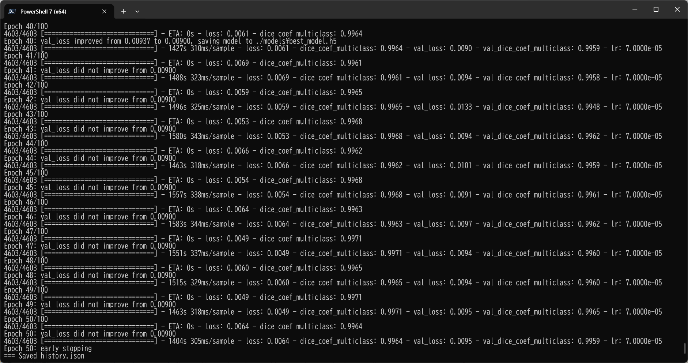 
 
<a href="./projects/TensorFlowFlexUNet/Brain-Tumor-MRI/eval/train_metrics.csv">train_metrics.csv</a> 
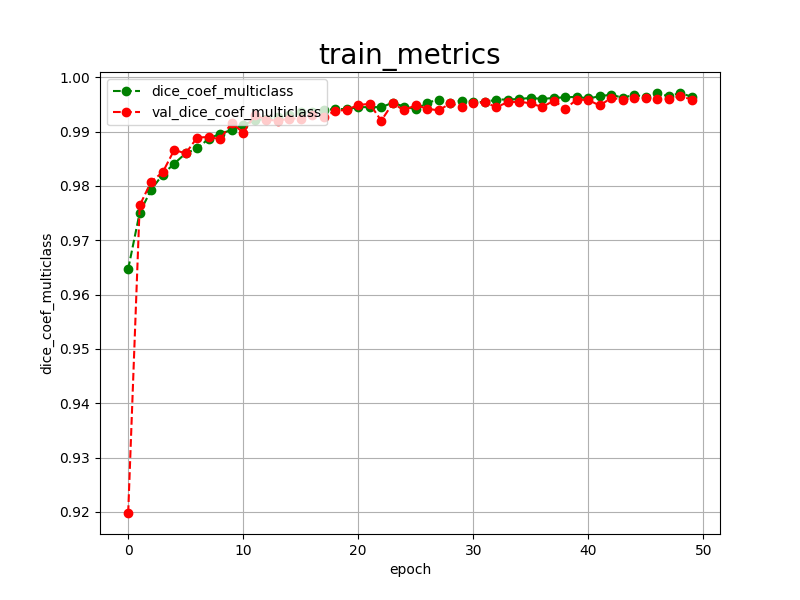 

 
<a href="./projects/TensorFlowFlexUNet/Brain-Tumor-MRI/eval/train_losses.csv">train_losses.csv</a> 
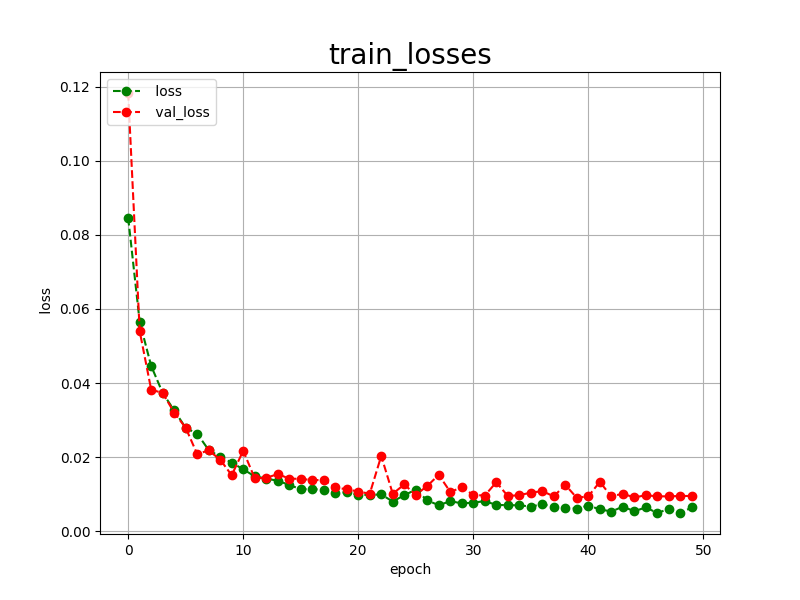 
 
<h3>
4 Evaluation
</h3>
Please move to a <b>./projects/TensorFlowFlexUNet/Brain-Tumor-MRI</b> folder, 
and run the following bat file to evaluate TensorflowFlexUNet model for Brain-Tumor-MRI. 
<pre>
>./2.evaluate.bat
</pre>
This bat file simply runs the following command.
<pre>
>python ../../../src/TensorFlowFlexUNetEvaluator.py  ./train_eval_infer.config
</pre>
Evaluation console output: 
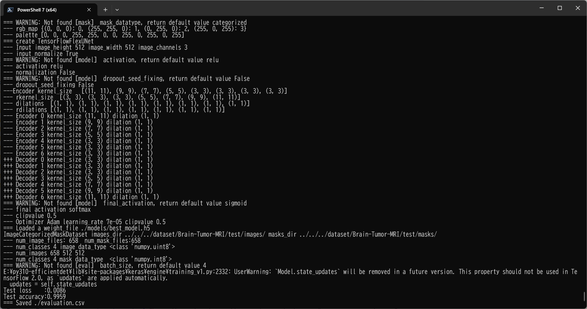
  Image-Segmentation-Brain-Tumor-MRI

<a href="./projects/TensorFlowFlexUNet/Brain-Tumor-MRI/evaluation.csv">evaluation.csv</a> 
The loss (categorical_crossentropy) to this Brain-Tumor-MRI/test was very low, and dice_coef_multiclass very high as shown below.
 
<pre>
categorical_crossentropy,0.0086
dice_coef_multiclass,0.9959
</pre>
 
<h3>5 Inference</h3>
Please move to a <b>./projects/TensorFlowFlexUNet/Brain-Tumor-MRI</b> folder 
,and run the following bat file to infer segmentation regions for images by the Trained-TensorflowFlexUNet model for Brain-Tumor-MRI. 
<pre>
>./3.infer.bat
</pre>
This simply runs the following command.
<pre>
>python ../../../src/TensorFlowFlexUNetInferencer.py ./train_eval_infer.config
</pre>

<b>mini_test_images</b> 
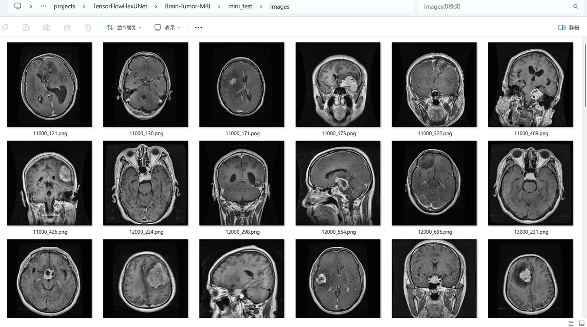 
<b>mini_test_mask(ground_truth)</b> 
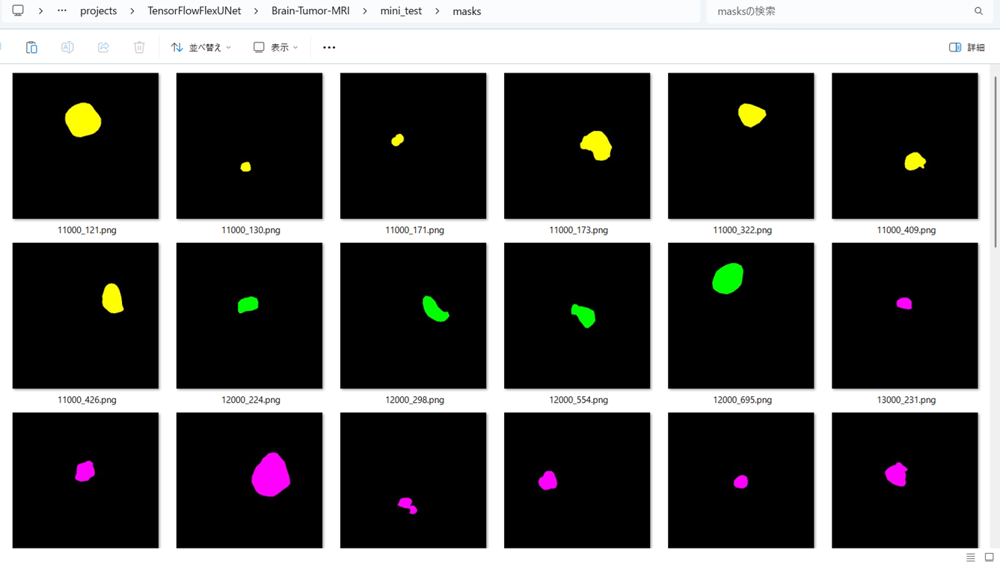 

<b>Inferred test masks</b> 
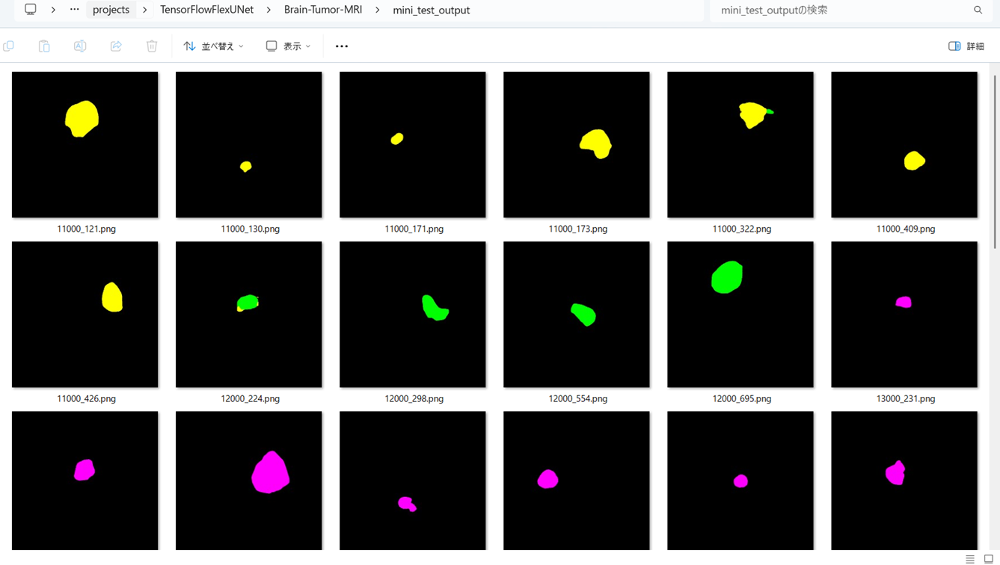 
 

<b>Enlarged images and masks for  Brain-Tumor-MRI  Images of 512x512 pixels</b> 
As shown below, the inferred masks predicted by our segmentation model trained by the dataset appear similar to the ground truth masks.
 
<b>rgb_map = {Glioma:yellow,  Meningioma:green, Pituitary tumor: mazenda}</b>
 
 
<table>
<tr>
<th>Input: image</th>
<th>Mask (ground_truth)</th>
<th>Prediction: inferred_mask</th>
</tr>
<tr>
<td>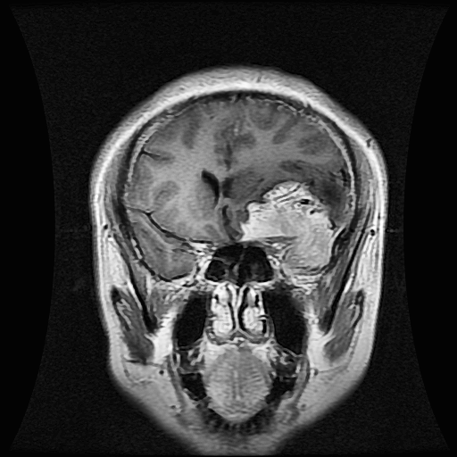</td>
<td>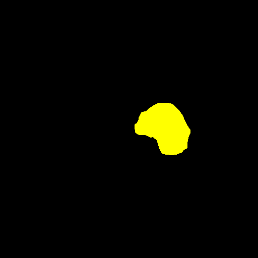</td>
<td>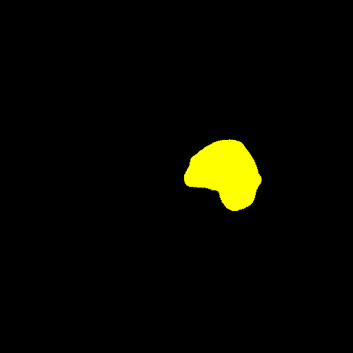</td>
</tr>

<tr>
<td>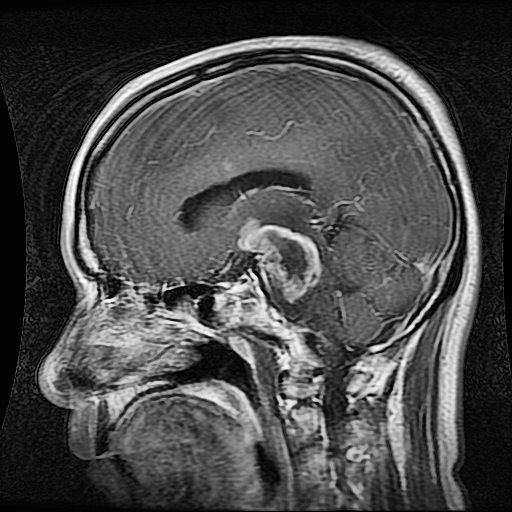</td>
<td></td>
<td>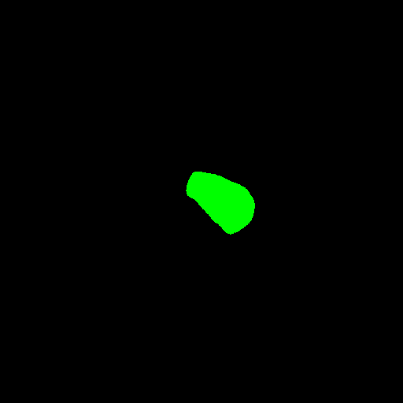</td>
</tr>

<tr>
<td>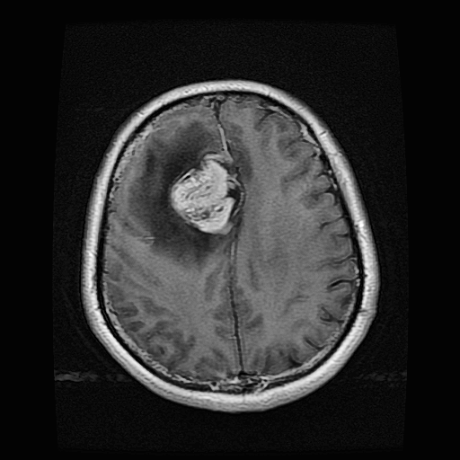</td>
<td>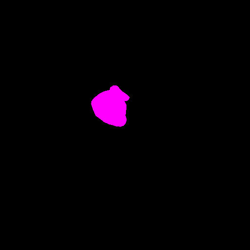</td>
<td></td>
</tr>
<tr>
<td>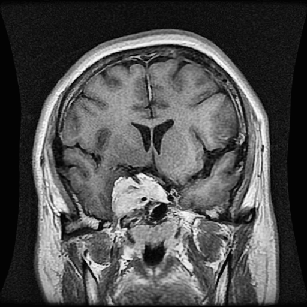</td>
<td>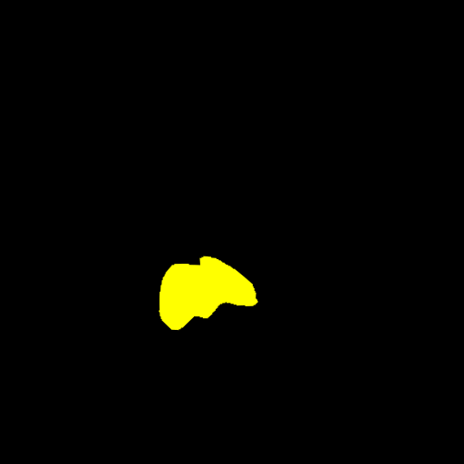</td>
<td></td>
</tr>
<tr>
<td>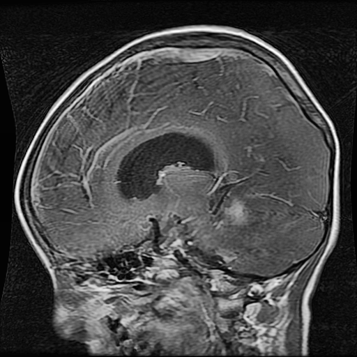</td>
<td></td>
<td>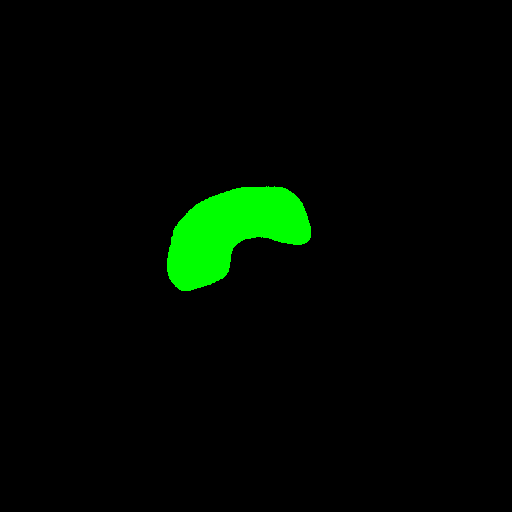</td>
</tr>
<tr>
<td>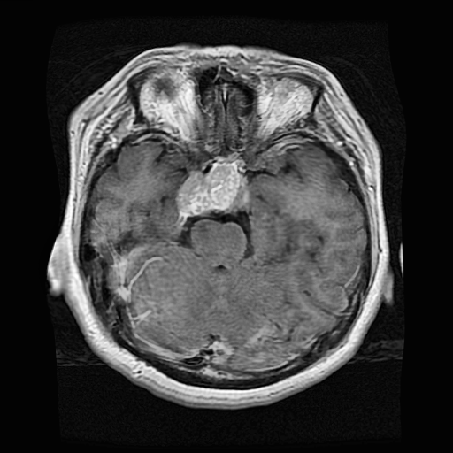</td>
<td></td>
<td>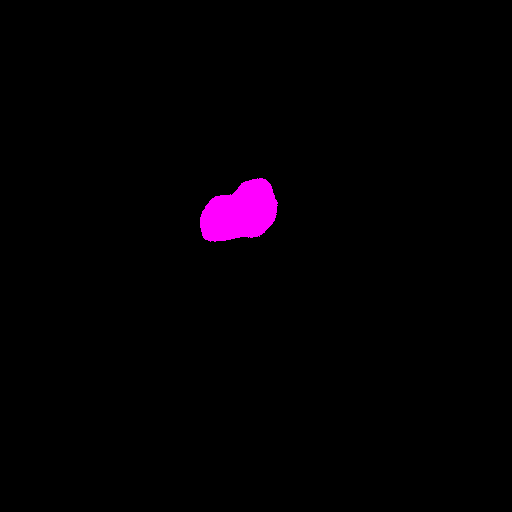</td>
</tr>
</table>

 
<h3>
References
</h3>
<b>1. TensorFlow-FlexUNet-Image-Segmentation-Figshare-BrainTumor</b> 
Toshiyuki Arai  
<a href="https://github.com/sarah-antillia/TensorFlow-FlexUNet-Image-Segmentation-Figshare-BrainTumor">
https://github.com/sarah-antillia/TensorFlow-FlexUNet-Image-Segmentation-Figshare-BrainTumor
</a>
 
 
<b>2. TensorFlow-FlexUNet-Image-Segmentation-BRISC2025-BrainTumor</b> 
Toshiyuki Arai  
<a href="https://github.com/sarah-antillia/TensorFlow-FlexUNet-Image-Segmentation-BRISC2025-BrainTumor">
https://github.com/sarah-antillia/TensorFlow-FlexUNet-Image-Segmentation-BRISC2025-BrainTumor
</a>
 
 
<b>3. TensorFlow-FlexUNet-Image-Segmentation-Brain-Tumor-BraTS2019-HGG-LGG-MRI</b> 
Toshiyuki Arai  
<a href="https://github.com/sarah-antillia/TensorFlow-FlexUNet-Image-Segmentation-Brain-Tumor-BraTS2019-HGG-LGG-MRI">
https://github.com/sarah-antillia/TensorFlow-FlexUNet-Image-Segmentation-Brain-Tumor-BraTS2019-HGG-LGG-MRI
</a>
 
 
<b>4. TensorFlow-FlexUNet-Image-Segmentation-Model</b> 
Toshiyuki Arai  
<a href="https://github.com/sarah-antillia/TensorFlow-FlexUNet-Image-Segmentation-Model">
TensorFlow-FlexUNet-Image-Segmentation-Model
</a>
 
 
